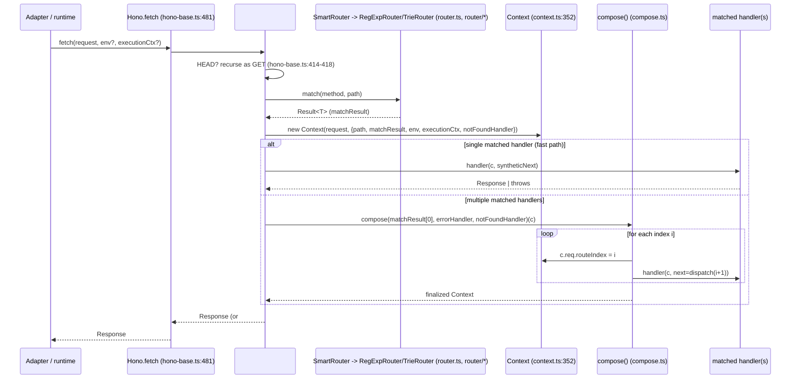

Analyzed repository: honojs/hono, commit edd138ee3049749190de3dcd7e32d7bcbf224e41 (upstream tag/version as reported by `git describe --tags`: v4.13.7-7-gedd138ee)

This is an analysis of an external open-source project (Hono, a TypeScript web framework), kept as a separate reference target from the subscription-splitter application. The clone lives at `/Users/sebastian.f/Projects/10xDevs/analysis/hono` and is not part of this repository.

**Target statement**: trace the request dispatch flow (`Hono.fetch` -> `#dispatch` in `hono-base.ts` -> router match -> `compose.ts` -> `Context`/`HonoRequest` -> `Response`), starting at `src/hono-base.ts`, because `context/map/repo-map.md`'s risk-zone section and first-day reading list both point at this exact core spine (`context.ts`/`types.ts`/`hono-base.ts`/`request.ts`/`compose.ts`) as the one area flagged by all three independent L2 signals: git co-change, dependency-graph fan-in, and cycle membership.

# Feature overview

## End-to-end trace (evidence: read directly from source at the pinned commit)

1. **Entry point** - `Hono.fetch` is a public instance property assigned in `src/hono-base.ts:481-487`: `fetch = (request, ...rest) => this.#dispatch(request, rest[1], rest[0], request.method)`. It reorders the public `(request, env?, executionCtx?)` signature into `#dispatch`'s internal `(request, executionCtx, env, method)` order.
2. **Default router wiring** - `src/hono.ts:15-30`: the concrete `Hono` class extends `HonoBase` and its constructor sets `this.router = options.router ?? new SmartRouter({ routers: [new RegExpRouter(), new TrieRouter()] })`. Verified directly by reading `src/hono.ts` in full - unless a caller passes a custom `router` option, every request through the main `Hono` class goes through `SmartRouter`, which itself wraps `RegExpRouter` and `TrieRouter`. **Corrected by ast-grep verification**: `src/hono.ts` is the main entry point, not the only preset - `src/preset/quick.ts` (`hono/quick`) wires `new SmartRouter({ routers: [new LinearRouter(), new TrieRouter()] })` instead. This does not change the dispatch trace itself (both still go through `SmartRouter -> Router<T>.match() -> Result<T>`), but a claim of "the" default router should be read as "the main `Hono` class's default."
3. **`#dispatch`** (`src/hono-base.ts:408-468`):
   - HEAD requests are rewritten to GET and recursed once (`src/hono-base.ts:414-418`): `if (method === 'HEAD') return (async () => new Response(null, await this.#dispatch(request, executionCtx, env, 'GET')))()`.
   - Path resolution and route matching (`src/hono-base.ts:420-421`): `const path = this.getPath(request, { env }); const matchResult = this.router.match(method, path)`.
   - A `Context` is constructed from the raw request and match result (`src/hono-base.ts:423-429`): `new Context(request, { path, matchResult, env, executionCtx, notFoundHandler: this.#notFoundHandler })`.
   - **Fast path** (`src/hono-base.ts:432-449`): if exactly one handler matched (`matchResult[0].length === 1`), it is invoked directly with a synthetic `next` that assigns `c.res = await this.#notFoundHandler(c)` if reached; errors are caught synchronously or via `.catch` on the returned promise and routed to `#handleError`.
   - **Composed path** (`src/hono-base.ts:452-467`): for more than one matched handler, `compose(matchResult[0], this.errorHandler, this.#notFoundHandler)` builds a runner, which is awaited; if the resulting context is not `finalized`, an explicit error is thrown ("Context is not finalized...").
   - `#handleError` (`src/hono-base.ts:401-406`) re-throws anything that is not an `Error` instance, otherwise delegates to the app's `errorHandler`.
4. **`compose`** (`src/compose.ts`, entire 73-line file): a closure-based recursive `dispatch(i)` function. Each call sets `context.req.routeIndex = i` (line 44) before invoking the matched handler at that index with a `next = () => dispatch(i + 1)` continuation (line 51). Calling `next()` twice at the same index throws `'next() called multiple times'` (lines 33-34). If no handler exists for a given index and no `next` was supplied by the caller of `compose`, the internal `onNotFound` handler runs (lines 61-65); thrown errors are routed to `onError` if provided (lines 52-60).
5. **`Context`** (`src/context.ts`):
   - Constructor (`src/context.ts:352-360`) stores the raw request and, from the `ContextOptions` object (`src/context.ts:237-251`: `{ env, executionCtx?, notFoundHandler?, matchResult?, path? }`), the execution context, env, not-found handler, path, and match result.
   - `.req` is a lazily-constructed getter (`src/context.ts:366-369`): `this.#req ??= new HonoRequest(this.#rawRequest, this.#path, this.#matchResult); return this.#req` - so `HonoRequest` is built once, on first access, from exactly the three pieces of state the constructor captured.
   - `.res` getter/setter (`src/context.ts:403-431`) lazily creates a default `Response` on first read, and on write merges headers from any previously-set response into the new one, with an explicit special case for `set-cookie` (appended, not overwritten) and a skip for `content-type` (left to the new response). **Corrected by ast-grep verification**: this "append, don't overwrite" rule for `set-cookie` is not unique to the `res` setter - `Context`'s private `#newResponse` helper (`src/context.ts:608-624`, backing `c.body()`/`c.json()`/etc.) implements the same rule independently (`if (key === 'set-cookie') { responseHeaders.append(key, value) } else { responseHeaders.set(key, value) }`). Two independent implementations of the same rule, not one - see Technical debt.
6. **`HonoRequest`** (`src/request.ts`): `routeIndex` is a plain public field, default `0` (line 53). `.param()` (lines 104-124) resolves parameter names against `this.#matchResult[0][this.routeIndex]` - i.e., which parameter map is "current" depends entirely on `routeIndex`, which only `compose.ts`'s `dispatch(i)` is documented to advance.
7. **Router contract** (`src/router.ts`): the `Router<T>` interface (lines 29-52) requires `add(method, path, handler)` and `match(method, path): Result<T>`. `Result<T>` (line 98) is a two-variant union: `[[T, ParamIndexMap][], ParamStash]` or `[[T, Params][]]`. `router.ts` itself has zero imports (confirmed: `grep -n "^import" src/router.ts` returns nothing) - it is a pure, dependency-free contract, matching its instability score of 0 in `artifact-2-structure.md`.
8. **Response returns up through `#dispatch`** to `fetch`, and from there to whatever adapter or runtime called it.

## Architecture insights

- **The core-spine cycle is partly type-only, not purely a runtime hazard.** Evidence (blast-radius sub-agent, verified against source): `compose.ts` imports `Context` and `types.ts` symbols only via `import type`; `types.ts` imports `Context` and `HonoBase` only via `import type` (confirmed at `src/types.ts:7-8`). The cycle `compose.ts -> context.ts -> request.ts -> types.ts -> hono-base.ts -> compose.ts` named in `artifact-2-structure.md` is therefore a genuine type-checking-time coupling (a shape change to `Context` or `HonoBase` forces `types.ts` to be re-checked, and vice versa), not a runtime circular-module-load hazard from this specific loop. This refines, rather than contradicts, artifact 2's finding, which already flagged (in its own limitations) that it does not distinguish type-only from value imports.
- **`Result<T>`'s two-variant union is a real, verified five-way contract.** Evidence (blast-radius sub-agent): `RegExpRouter`'s matcher returns the `[HandlerData, ParamStash]` variant (`src/router/reg-exp-router/matcher.ts:10-30`); `TrieRouter`, `LinearRouter`, and `PatternRouter` all return the single-element `[handlers]` variant (`src/router/trie-router/node.ts:86`, `src/router/linear-router/router.ts:25`, `src/router/pattern-router/router.ts:38-51`); `SmartRouter` is a pass-through of whichever wrapped router wins (`src/router/smart-router/router.ts:21-38`) and does not itself normalize the shape. `#dispatch`'s fast/composed-path branch only ever reads index `0` (shared by both variants); the variant-dependent index `1` is consumed with an explicit truthiness check in `HonoRequest`'s `.paramData` accessor at `src/request.ts:124`. A change to either union variant is a five-file change: `router.ts` (the type) plus all four router implementations plus `request.ts`'s consumer.
- **`routeIndex` is a semi-public seam.** Evidence (blast-radius sub-agent): three files outside `compose.ts`/`request.ts` read or write `c.req.routeIndex` directly, relying on it meaning "index into `matchResult[0]` of the currently-executing step in the composed chain": `src/middleware/combine/index.ts:101,106` (saves/restores it around a nested `compose()` call), `src/middleware/method-not-allowed/index.ts:65,105,108` (reads it to compute the `Allow` header), and `src/helper/route/index.ts:59,83,108` (the public `hono/route` helper defaults to it). This is a direct call-site dependency, not just historical co-change.
- **Adapters are insulated from `#dispatch`'s internals by the public `fetch` wrapper.** Evidence (blast-radius sub-agent): `grep -rn "\.fetch(" src/adapter` finds six adapters (`aws-lambda`, `lambda-edge`, `netlify`, `vercel`, `service-worker`, `cloudflare-pages`) calling `app.fetch(request, env?, executionCtx?)` - the stable public signature - and none construct a `Context` or reference `ContextOptions` or `#dispatch` directly. `bun`, `cloudflare-workers`, and `deno` adapters contain no `.fetch(` call at all; invocation happens in user code or the runtime outside this repository's `src/adapter/*` files.
- **The client (`hc()`) depends only on types, never on runtime `Context`/`HonoRequest`.** Evidence (blast-radius sub-agent): `src/client/client.ts` and `src/client/types.ts` import `Hono`/`HonoBase`/route types only via `import type`; neither imports `../context` or `../request`. The one apparent reference (`type HonoRequest = (typeof Hono.prototype)['request']` in `src/client/types.ts:28`) is a locally-derived type alias from `Hono`'s public `request()` method signature, not an import of the `HonoRequest` class.

# Technical debt

## Test coverage gaps on this specific path

Evidence gathered by direct reading of test files (test-gap sub-agent; no coverage tool was run, so these are presence/absence-of-assertion findings, not statement/branch percentages).

Well-covered, confirmed with test file:line: the public `fetch` entry point (`src/hono.test.ts:2800-2819`); the single-handler fast path's sync-throw, async-rejection, and no-response-returned branches (`src/hono.test.ts:1942-1967`, `1459-1489`, `2294-2306`); the fast path's synthetic-next-into-notFoundHandler branch (`src/hono.test.ts:1330-1341`); the composed multi-handler path (`src/hono.test.ts:1602-1611`, `1349-1367`); the "Context is not finalized" throw, both the missing-`await next()` and missing-return sub-cases (`src/hono.test.ts:2309-2337`); `compose.ts`'s ordering, error fold-in, not-found fold-in, and the "next() called multiple times" guard (`src/compose.test.ts:363-402`, `235-300`, `145-181`, `651-662`); `Context.res`'s default and the `set-cookie` merge special case (`src/context.test.ts:336-340`, `420-455`); `HonoRequest.param()`'s use of `routeIndex` at the unit level (`src/request.test.ts:60-95`); the `Router<T>` contract and `RegExpRouter` implementation (`src/router/common.case.test.ts`, `src/router/reg-exp-router/router.test.ts`, ~25 cases).

Gaps, ranked by significance (Evidence: absence confirmed by reading the named test files; each is also a plausible real risk, not just a missing assertion - Inference on the risk framing):

1. **`compose.ts`'s `routeIndex` advancing (`src/compose.ts:44`) is never exercised by a `compose()`-level test.** `src/compose.test.ts` never references `routeIndex` and never builds a real `matchResult`; it verifies ordering only via `c.set()`/`c.get()`. The only test proving `routeIndex`-dependent `param()` resolution (`src/request.test.ts:60-95`) manually sets `req.routeIndex = 1` rather than driving it through a real composed chain with multiple middleware. **Inference**: this means a bug in `compose.ts`'s `context.req.routeIndex = i` assignment (e.g. an off-by-one, or skipping it under some new branch) could regress silently for any multi-middleware route where each step reads different route parameters, since no test asserts an *earlier* middleware in a real chain sees the correct per-step params.
2. **The HEAD-to-GET rewrite (`src/hono-base.ts:414-418`) is only tested against the single-handler fast path** (`src/hono.test.ts:2908-2933`). No test drives a HEAD request through the `compose()` path, and none combines HEAD with an error handler or a 404.
3. **`Context`'s constructor and lazy `req` getter have no isolated unit test with the full `{ path, matchResult, notFoundHandler }` option set** (`src/context.ts:352-369`); coverage is entirely incidental, via full-app dispatch tests in `hono.test.ts`. Nothing verifies the lazy getter's memoization (that repeated `c.req` access returns the same `HonoRequest` instance).
4. **`RegExpRouter`'s `MESSAGE_MATCHER_IS_ALREADY_BUILT` error path is untested**: `grep -rn "MESSAGE_MATCHER_IS_ALREADY_BUILT\|already built"` across `src/router/**/*.test.ts` found no hits.
5. Lower severity: `#dispatch`'s fast-path synthetic `next` (`src/hono-base.ts:435-437`) has no "called multiple times" guard, unlike `compose.ts`'s `dispatch(i)`, and no test exercises calling it twice - an asymmetry between the two dispatch paths worth flagging rather than a strict coverage gap.

**Unknown**: no coverage tool was run, so exact statement/branch percentages are unknown; a test elsewhere in the suite that incidentally exercises `routeIndex` through a real `compose()` call may have been missed by the greps used (`grep -n "routeIndex"` across `src/*.test.ts` and `src/router/**/*.test.ts`).

## Coupling and blast radius

Evidence (blast-radius sub-agent, cross-checked against `artifact-1-territory.md` and `artifact-2-structure.md`), ranked by how directly coupled each consumer is to a change in `#dispatch`/`compose`/`Context`'s options shape:

**Must change in lockstep** (real import/call-site dependency, not just co-change):
- Any of the four router implementations plus `router.ts`'s `Result<T>` type plus `request.ts`'s param-resolution code, if the match-result shape changed - a verified five-file contract (see Architecture insights above).
- `src/middleware/combine/index.ts`, `src/middleware/method-not-allowed/index.ts`, `src/helper/route/index.ts`, if `routeIndex`'s meaning or `compose()`'s per-step assignment changed - direct call-site reads/writes, not merely files that happen to be edited nearby.
- `src/helper/route/index.test.ts`, if `ContextOptions`'s shape or `Result<[H, RouterRoute]>` changed - it hand-builds a `matchResult` literal and constructs `Context` directly with the full options object; it is the only test file outside the core/router files found to reference `matchResult` (`grep -rln "matchResult" src` outside the core/router files returns only this one test file).

**Should be re-verified, but insulated by a stable public seam:**
- All six `.fetch()`-calling adapters (`aws-lambda`, `lambda-edge`, `netlify`, `vercel`, `service-worker`, `cloudflare-pages`) - they depend only on the public `fetch(request, env?, executionCtx?)` signature, which is a stable wrapper around `#dispatch`'s differently-ordered private signature. **Inference**: a refactor that changes `#dispatch`'s internals while preserving `fetch()`'s observable contract should not require adapter changes, though this cannot be fully guaranteed without re-running the adapters' own tests/runtime-tests harnesses.
- `src/client` (`hc()`/RPC types) - type-level dependency on `Hono`/`HonoBase`'s method signatures only, never on `Context`/`HonoRequest` at runtime.

**Git co-change data adds a distinct, softer signal** (`artifact-1-territory.md`): `src/client <-> src/hono-base.ts` co-changed 3 times in 12 months. **Inference**: combined with the verified type-only import structure, this is best read as type-level re-verification churn (the client's inferred RPC types), not a runtime dependency - artifact 1 itself does not explain the "why" of its co-change counts, so this causal reading is an inference, not a claim either artifact makes directly. Separately, `runtime-tests/lambda <-> src/adapter` co-changed 4 times, consistent with adapter changes commonly being verified against their runtime-tests harness in the same commit (implementation-plus-its-own-integration-test coupling, not a design smell).

**A notable asymmetry**: `compose.ts` and `router.ts` do not appear in `artifact-1-territory.md`'s top-10 touched files/directories list (12-month window), despite being structurally central to this flow (every dispatch goes through both). By file-level touch count in that same window: `request.ts` 15, `context.ts` 14, `types.ts` 13, `hono-base.ts` 11 - `compose.ts` and `router.ts` are comparatively low-churn. **Inference**: structural centrality does not equal empirical co-churn for these two files; a plausible read is that they are small, conceptually stable modules (a generic middleware runner, a pure type/constant contract) that do not need frequent edits even as adjacent files change, but this is inference, not something either artifact states directly.

## Duplication found during ast-grep verification

The `set-cookie` "append, don't overwrite" header-merge rule is implemented independently in two places in `src/context.ts`: the public `res` setter (lines 421-425) and the private `#newResponse` helper behind `c.body()`/`c.json()`/etc. (lines 618-622). **Evidence**: both confirmed by direct reading; see `ast-grep-verification.md` section 10. **Inference**: this is small, low-risk duplication today (both copies currently agree), but it is a real place where the two copies could silently drift if only one is updated - worth consolidating into one helper rather than something to defer indefinitely, though it is not urgent given its current size (two similar four-line blocks).

Separately, a methodological note for anyone re-running similar structural counts on this codebase: a naive `.fetch(` grep over the `src/adapter` tree over-counts real Hono dispatch call sites by 2 (a `service-worker` fallback-option call and a Cloudflare Pages static-assets binding call are not `app.fetch`). The precise count is 7 `app.fetch(...)` call sites across 6 adapter files (`ast-grep-verification.md` section 4).

## Unknowns (from both sub-agents, stated explicitly rather than treated as "no risk")

- Whether `bun`, `cloudflare-workers`, or `deno` adapters have deeper files beyond their `index.ts` barrels that touch `Context`/`compose`/`ContextOptions` was not checked.
- The three adapters checked only around their `.fetch()` call sites (`aws-lambda`, `lambda-edge`, `cloudflare-pages`) may have other, less direct couplings further into those files that were not read.
- `SmartRouter`'s runtime router-selection/caching logic was confirmed to pass through the wrapped router's `Result<T>` shape, but its internal fallback/caching behavior was not traced in full.
- No coverage tool was run; branch/statement percentages for this flow are unknown, only presence or absence of a specific assertion per branch as found by reading test files directly.
- A full audit of every test file in the repository for incidental `routeIndex`/`compose()` interaction was not performed; the search was scoped to `src/*.test.ts` and `src/router/**/*.test.ts`.
