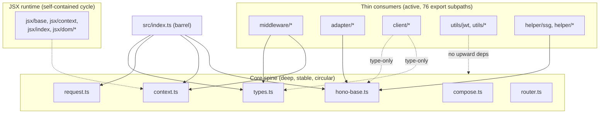

Analyzed repository: honojs/hono, commit edd138ee3049749190de3dcd7e32d7bcbf224e41 (upstream tag/version as reported by `git describe --tags`: v4.13.7-7-gedd138ee)

This is an analysis of an external open-source project (Hono, a TypeScript web framework), used as a separate practice target for repository-mapping and kept out of the subscription-splitter application itself. The clone lives at `/Users/sebastian.f/Projects/10xDevs/analysis/hono`. Full evidence and commands are in `artifact-1-territory.md`, `artifact-2-structure.md`, and `artifact-3-contributors.md` in this same folder - this document synthesizes them and does not repeat their tables.

# Repo Map - Hono

## 1. TL;DR

Hono is a single-package TypeScript web framework (no monorepo, no path aliases) whose entire public surface - 76 subpath exports covering routers, middleware, adapters, and helpers - funnels into one small, stable core: `context.ts`, `types.ts`, `hono-base.ts`, `request.ts`, `compose.ts`, and `router.ts`. Real work over the last year has concentrated in `src/middleware`, `src/utils`, `src/jsx`, `src/adapter`, and `src/client`, all of which are thin consumers of that core. The core itself is small, mutually circular by design, and effectively owned by one maintainer (Yusuke Wada), who has already reverted at least one change there. JSX rendering is a second, self-contained circular cluster with no bearing on the rest of the framework. Layer boundaries (utils -> router -> core -> middleware/adapter/client) are clean with zero violations found. The main things to be careful about are edits to the core spine (wide blast radius, thin margin for "obviously safe" micro-optimizations) and the `helper/ssg` and `aws-lambda` adapter modules (integration-shaped, hard to unit-test in isolation).

## 2. Terrain - where the system lives

- **Deep, stable core**: `types.ts` (fan-in 53) and `context.ts` (fan-in 46) are imported by roughly a quarter to a third of all modules under `src/`; `router.ts` has instability 0 (nothing else depends on to build it, but is depended upon heavily) - see `artifact-2-structure.md`. These four-to-six files are the real foundation, not the directory names.
- **Thin, active periphery**: the busiest directories by commit count (`src/middleware`, `src/utils`, `src/jsx`, `src/adapter`, `src/client`, `src/helper` - `artifact-1-territory.md`) are almost all low-fan-out consumers of the core (e.g. `middleware/etag` fan-out 2, `middleware/cors` fan-out 2). The directory structure and the real "where work happens" map line up well here - unlike some legacy repos, activity isn't hiding in a folder that looks peripheral.
- **Activity over time**: `src/middleware` and `src/utils` were active in every one of the last four quarters (sustained, not a spike). `src/router` was proportionally busier a year ago; `src/client` grew sharply in the most recent quarter - a possible signal of renewed investment in the RPC/type-inference client.
- **Release noise excluded**: root `package.json` shows 90 touches in 12 months, but ~all are automated version-bump commits (one per patch release), not feature work - excluded from all territory rankings.

## 3. Real couplings - what actually changes together

- **Core spine circularity** confirmed by three independent signals at once: git co-change (artifact 1), dependency-graph fan-in (artifact 2), and cycle membership (artifact 2) all point at the same five files - `hono-base.ts`, `types.ts`, `context.ts`, `request.ts`, `compose.ts`. Source: import graph (`dependency-cruiser`, `--ts-pre-compilation-deps`) plus git history; this is a real, manual-edit coupling, not a generated-code artifact.
- **JSX runtime is its own circular island** (43 of 53 total cycles): `jsx/base.ts`, `jsx/context.ts`, `jsx/index.ts`, `jsx/components.ts`, `jsx/dom/*`. Source: import graph only. It does not reach outside `src/jsx/`, so it is a contained risk, not a repo-wide one.
- **Adapter <-> its runtime-tests harness**: `src/adapter/aws-lambda` co-changes with `runtime-tests/lambda` in the same commits (artifact 1). This is expected, healthy coupling (implementation + its integration test), not a design smell.
- **No graph exists for `runtime-tests/*`, `perf-measures/*`, `benchmarks/*`, or `docs/`** - the dependency-cruiser scan is scoped to `src/`. Any coupling touching those areas is only known from git co-change, and is explicitly `unknown` from the import-graph side, not "no coupling."
- **Layer boundaries hold cleanly**: `utils -> {middleware, router, adapter, client}`, `router -> {middleware, adapter}`, `middleware -> adapter`, and `core -> {middleware, adapter, client}` were all checked as forbidden-import rules against the full 568-edge graph - zero violations. `src/client` depends downward on core types, but only for `InferRequestType`/`InferResponseType`-style type inference (verified by reading the four files in `src/client`), never the reverse.

## 4. Risk zones

| Zone | Why |
|---|---|
| `context.ts` / `hono-base.ts` / `types.ts` / `request.ts` / `compose.ts` (core spine) | Highest fan-in in the repo, mutually circular, and a documented revert already happened here (`#5174` reverted by `#5186`) - a plausible-looking micro-optimization was tried and undone once. |
| `src/jsx/*` (rendering runtime) | 43 internal cycles; anything touching JSX rendering has a wide, hard-to-reason-about blast radius within that subsystem specifically. |
| `src/helper/ssg` | Fan-out 9, reaches into `client/utils.ts` and the full `Hono` app type - integration-shaped, hard to unit-test in true isolation. |
| `src/adapter/aws-lambda` | Second-most-touched non-test file (`handler.ts`, 14 touches/12mo) with a real string of runtime bugfixes (backpressure, binary detection, header sanitization); best verified against its `runtime-tests/lambda` harness, not mocked. |
| `src/utils/jwt` + `src/middleware/jwk`/`jwt` | High recent activity (27 touches on `utils/jwt` alone) in security-sensitive code (JWT/JWK validation); self-contained (good for unit tests) but a correctness bug here is a security bug. |
| `runtime-tests/*` and `perf-measures/*` coupling to `src/` | `unknown` from the dependency graph (out of scope for `dependency-cruiser` here) - only visible as git co-change; treat any inferred coupling here as weaker evidence than the graph-backed findings above. |

## 5. Who to ask

- **Core spine / hot-path performance work**: Yusuke Wada is by far the dominant contributor (19 of ~45 core-spine commits in 12 months) and personally authored the perf-tuning thread through `context.ts`/`hono-base.ts`; Igor Savin has contributed in the same style (`artifact-3-contributors.md`). Read `#5174`/`#5186` before touching `Context`'s constructor field order specifically.
- **Routing/request edge cases**: no single owner - Taku Amano fixed two specific cases (unmatched-request params, mounted-route base path) but the broader edge-case history is dispersed across ~20 one-off contributors. Expect to find the relevant historical PR for your specific case rather than a person to ask.
- **JSX runtime, `aws-lambda` adapter, `jwt`/`jwk` middleware**: not analyzed at contributor level in this pass (only the core spine was; see `artifact-3-contributors.md` for why it was chosen) - this is an explicit gap, not "nobody works on it." A follow-up contributor pass on these three areas is the natural next artifact-3 run.

## 6. First day - files to read in order

1. `src/index.ts` - the whole public barrel in ~40 lines; shows exactly what the framework exports and from where.
2. `src/types.ts` - the most depended-upon file in the repo; read this before anything else that touches types.
3. `src/context.ts` - second-most depended-upon; the request/response context object every handler and middleware receives.
4. `src/hono-base.ts` - the `Hono` app class that wires router + context + compose together; instability 0.57, the one core file that's genuinely "middle layer" rather than purely foundational.
5. `src/compose.ts` - the middleware composition/dispatch mechanism; small file, but part of the core cycle, worth understanding before changing middleware ordering behavior.
6. `src/router.ts` plus one concrete implementation, `src/router/reg-exp-router/router.ts` - the router contract and the default, self-contained implementation.
7. One thin middleware for contrast, e.g. `src/middleware/cors/index.ts` (fan-out 2) - shows what "the common case" looks like once you've read the core.
8. `package.json`'s `exports` map - a two-minute skim shows the full 76-entry public surface, so you know what else exists beyond what you've read.

## 7. Limitations

- Time window: git analysis covers the last 12 months of commit history only (412 of 2815 total commits); older architectural decisions (e.g. why three router implementations exist) are invisible here.
- Method: co-change is commit-level, not PR-level, and a handful of repo-wide tooling commits (tsconfig/eslint bumps) inflate raw co-change counts - called out explicitly in `artifact-1-territory.md` rather than silently included.
- Dependency graph scope: `src/` only, tests excluded; `runtime-tests/*`, `perf-measures/*`, `benchmarks/*`, and `docs/` have no import graph - any relationship touching them is `unknown`/git-only evidence, never "confirmed no relationship."
- Contributor analysis: only the core spine was profiled (chosen as the single most central/suspicious area per the exercise scope); JSX, the Lambda adapter, and JWT/JWK middleware have known risk but no contributor data yet.
- No source-level review was performed beyond what was needed to verify graph edges (e.g. confirming the client-to-core dependency is type-only); this map describes activity and structure, not correctness.
